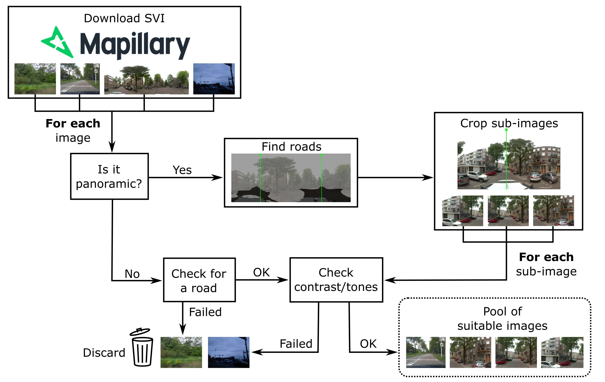
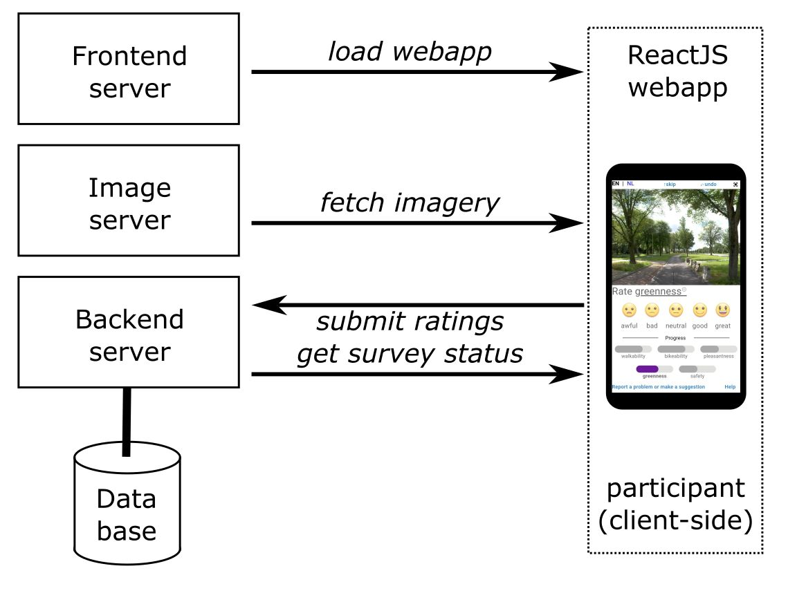

# Configuring, preparing and running a human perception survey

## Before getting started

We assume some basic familiarity with Linux and being able to run commands from the shell. Being able to copy-paste examples from here, and adjust them slightly to fit your needs (as described), is sufficient. It may be possible to do everything within other compatible systems such as BSD or Windows Subsystem for Linux but for the sake of simplicity we will focus here on Linux as generically as possible. We will describe dependencies from Debian/Ubuntu and RedHat/CentOS, for your convenience, but for other distributions there should be comparable packages. The shell is assumed to be `bash` but commands should largely work regardless of which shell you are using.

## Dependencies

- [Python](https://www.python.org/) v3.6 or higher and [PIP](https://pypi.org/project/pip/). Further Python package dependencies will be described along the way.
- [PostgreSQL](https://www.postgresql.org/) major version 13 or higher and suitable [PostGIS](https://postgis.net/) to go along with it (3.3.2 or higher; versions of PostGIS are linked to PostgreSQL version so be aware)
- [Apache2](https://httpd.apache.org/) (you could use a different web server but this is the one we will give instructions for)
- [NodeJS](https://nodejs.org/en) (developed under v18.4.2; check back for updates to latest NodeJS)

### NodeJS

We highly recommend installing NodeJS using [Node Version Manager (nvm)](https://github.com/nvm-sh/nvm) and NOT from your Linux distribution's package manager. This way, you can choose the specific version of NodeJS to use with this server (e.g., most likely you will want to choose version 18 for now).

With nvm, go ahead and install NodeJS v18 using the following command: `nvm install 18` and you can enable it right away with the command `node use 18`.

### Debian (bullseye v11 or above) / Ubuntu (jammy v22.04 or above)

Most of the necessary software is available from the standard packages repository:

- `apt-get install -y git python3-pip postgresql postgresql-postgis apache2 screen sudo`

If you have an older version of Debian or Ubuntu then you will have to look into 'backports', or better yet, upgrade (especially if this is going to be a public-facing server).

### RedHat / Fedora / CentOS or EL 7

On a recent version of a RedHat-based distro you should be able to use Yum simply with:
- `yum -y install git python3-pip postgresql postgresql-server postgis httpd screen sudo`

However, on older releases like CentOS or Enterprise Linux 7 then you will need additional steps to get PostgreSQL 13 or higher.

#### PostgreSQL 13 for CentOS or EL 7
- `yum -y install https://download.postgresql.org/pub/repos/yum/reporpms/EL-7-x86_64/pgdg-redhat-repo-latest.noarch.rpm`
- `yum -y update`
- `yum -y install postgresql13 postgresql13-server postgis33_13`

## Create a normal user

Log into your server machine as the user under which you wish to run the backend (and frontend) servers. This should not be root. If you are root, and have not yet made a normal user, then create a user with a suitable name and a secure password (e.g. using the `adduser` command). Be sure to put your normal user in the `sudo` (Debian/Ubuntu) or `wheel` (RedHat) group. You can do this by running a command like `adduser <my_user> sudo` as root. Then go ahead and log into your normal user while continuing this tutorial.

## Getting our software

Please clone or download the [percept-vsvi-filter](https://github.com/Spatial-Data-Science-and-GEO-AI-Lab/percept-vsvi-filter) repository and open a shell in that directory.

e.g. `git clone https://github.com/Spatial-Data-Science-and-GEO-AI-Lab/percept-vsvi-filter && cd percept-vsvi-filter`

## Mapillary API key

You will need a Mapillary developer API key in order to run the script that downloads imagery. This can be obtained free-of-charge from the [Mapillary Developer Dashboard](https://www.mapillary.com/dashboard/developers). You will need to register a Mapillary account first, and then you can register an application on the dashboard. Please simply choose something reasonably descriptive for the App Name and Description. Remember that you are ultimately responsible for using the developer access according to the [terms of service](https://www.mapillary.com/terms); read everything of course, but in particular, consider section 11 **Additional Terms for Developers**. Our scripts are provided as-is and come with NO warranty and NO guarantee. To the best of our knowledge these scripts comply with the terms of service for non-commercial usage, provided that you attribute the downloaded imagery to Mapillary if and when you serve them from your own servers.

In the end, you will need to copy the text in the field `Client Token` from the developer dashboard and save it in a file, we recommend calling that file `token.txt` and putting that file in the `percept-vsvi-filter` directory that you obtained in the previous step, where the `mapillary_jpg_download.py` script lives.

Tokens are like passwords, so do NOT commit the token file to a repository, do not include your token in any code file, and in fact if you use `git` then adding `token.txt` to your `.gitignore` file is a good idea (there are similar features in other version control systems too).

# Preparation overview

The downloading and processing steps, visualized:

## Downloading the imagery from Mapillary

Please see the [Downloading](downloading.md) chapter.

## Processing and filtering the imagery

Please see the [Processing](processing.md) chapter.

# Client/Server overview

We will walk through the steps of configuring an image server, the backend and the frontend to serve the web-app as depicted in this diagram:

## Configuring the image server

Please see the [Apache2 web server](apache.md) chapter.

## Configuring the backend

## Configuring the frontend

(under construction)

